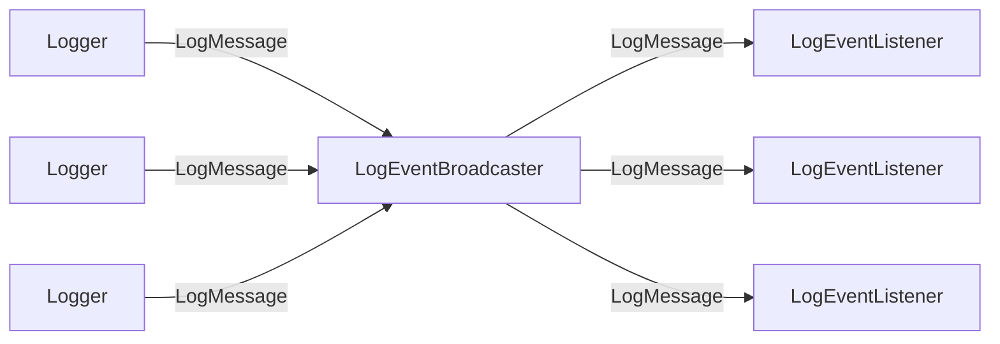
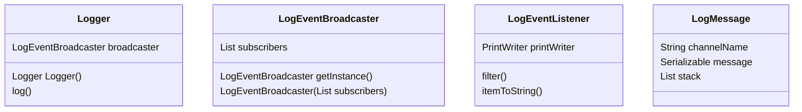

# kLLog[killog] - light Kotlin Logging Framework

logging framework written in Kotlin.

## reactive architecture

Flowchart


Class Diagram



The developer should use an instance of Logger
inside each class/function.

```kotlin
val logger=Logger.getInstance()
```

The method logger.log(channelName, message) will build a `LogMessage` and place it in the message broadcaster queue. The message broadcaster will react notifying its subscribers (`LoggerMessageListener`s).

### Logger

```kotlin
log(channelName: String, message: Serializable)
```

Emits a `LogMessage` containing the message object.

### LoggerMessageBroadcaster

receives messages (`LogMessage`s) from loggers and dispatches them to the `LoggingEventListener`s

Should be configured at the application entry point.
The configuration is done programmatically using the constructor.

If you need a cofiguration based on text files (.properties,xml,json,ini,...etc. ) you can choose whatever solution you deem fit for the task:  parsing the text file configuration into a list of LoggingEventListener.

Note: Text based configurations are used to make the application admin-friendly. If you are the dev and the administrator at the same time there's no point on using text based config.

If you need to bind into a well known logging framework, you can do it at the subscriber ( event listener ) level.

#### LogMessageBroadcaster constructor

```kotlin
val lmb = LogMessageBroadcaster(
  listeners= listOf<LogEventListener>(
    LogEventListener(
      name="everything out to console",
      printStream=System.out.getPrintWriter(),
      filter= (i:LogMessage)->true,
      toString= (i:LogMessage)-> i.toString(),
    ),
    LogEventListener(
      name="httpErrors",
      printStream=File("logs/http-error.log").getPrintWriter(),
      filter= (i:LogMessage)-> i.className=="HttpConnection" && i.channelName=="error",
      toString= (i:LogMessage)-> i.toString(),
    ),
  )
)
```

The LogMessageBroadcaster is static, it has a single instance and should  be configured once ( in main f.i. ).

### LogEventListener
#### constructor

```kotlin
val lel = LogEventListener(
  nam="some log event listener",
  printWriter= System.out.getPrintWriter(),
  filter=(i:LogMessage)->Boolean,
  toString= (i:LogMessage)-> "${i.timestamp} ${i.channelName.uppercase()} ${i.className} ${i.methodName} ${i.filename}:${i.lineNumber} ${i.message.toString()}",
)
```
receives `LogMessage`s from the `LogEventBroadcaster`.

If for a given message, the filter evaluates to true then it will println the result of the toString function with the given `PrintWriter`.

Anything with a file descriptor can be opened as a `PrintWriter` ( sysout, files, pipes )

#### predefined static stringifiers
##### csv
```kotlin
LoggerEventListener.toCsvString(i:LogMessage)->String
```

##### json
```kotlin
LoggerEventListener.toJsonString(i:LogMessage)->String
```

##### xml
```kotlin
LoggerEventListener.toXmlString(i:LogMessage)->String
```

# installation
// TODO
use  the script install.sh to clone and init a copy of this repository

```bash
curl https://raw.githubusercontent.com/alfu32/starter-kotlin-maven/main/install.sh | sh -
```
