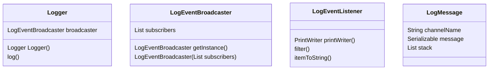

### status


# kLog[keelog] - light Kotlin Logging Framework

logging framework written in Kotlin.

## reactive architecture

Flowchart


Class Diagram



The developer should use an instance of Logger
inside each class/function.

```kotlin
val logger=Logger()
```
The logger instance uses the LogMessageBroadcast to emit LogMessages.
The log message is dispatched to each LogMessageListener.

The method logger.log(channelName, message) will build a `LogMessage` and emit it through the message broadcaster.

### Logger

```kotlin
log(channelName: String, message: Serializable)
```

Emits a `LogMessage` through the message broker.

### LoggerMessageBroadcaster

receives messages (`LogMessage`s) from loggers and dispatches them to the `LogMessageListener`s

Should be configured at the application entry point.
The configuration is done programmatically using the constructor.

If you need a cofiguration based on text files (.properties,xml,json,ini,...etc. ) you can choose whatever solution you deem fit for the task:  parsing the text file configuration into a list of LogMessageListener.

Note: Text based configurations are used to make the application admin-friendly. If you are the dev and the administrator at the same time there's no point on using text based config.

If you need to bind into a well known logging framework, you can do it at the subscriber ( event listener ) level.

#### LogMessageBroadcaster constructor

```kotlin
import java.io.File
import java.io.FileOutputStream
import java.io.PrintWriter

..........

LogMessageBroadcaster.subscribe(
  listeners= listOf<LogEventListener>(
    LogMessageListener(
      name="everything out to console",
      printWriter= {PrintWriter(System.out, true)},
      filter= (i:LogMessage)->true,
      toString= (i:LogMessage)-> i.toString(),
    ),
    LogMessageListener(
      name="httpErrors",
      printWriter={PrintWriter(FileOutputStream(File("logs/http-error.log"),true),true)},
      filter= (i:LogMessage)-> i.className=="HttpConnection" && i.channelName=="error",
      toString= (i:LogMessage)-> i.toString(),
    ),
  )
)
```

The LogMessageBroadcaster is static.
the subscribe method will add subscribers replacing the existing ones that have the same name.

### LogMessageListener
#### constructor

```kotlin
val lel = LogMessageListener(
  name="some log event listener",
  printWriter= {PrintWriter(System.out,true)},
  filter=(i:LogMessage)->Boolean,
  toString= (i:LogMessage)-> "${i.timestamp} ${i.channelName.uppercase()} ${i.className} ${i.methodName} ${i.filename}:${i.lineNumber} ${i.message.toString()}",
)
```
receives `LogMessage`s from the `LogMessageBroadcaster`.

If for a given message, the filter evaluates to true then it will println the result of the toString function using one instance from the LogMessageListener.printWriter() mixin.

Anything with a file descriptor can be opened as a `PrintWriter` ( sysout, files, pipes )

The factory function opens the possibility to journal the files like this

```kotlin
 val lel = LogMessageListener(
  name="journaled-json",
  printWriter={
    val dateStamp=DateTimeFormater.ofPattern("yyyy-MM-dd").format(Instant.now())
    val fn = "log-json-$dateStamp.json"
    PrintWriter(
      FileOutputStream(
        File(fn),
        true,/*open in append mode
          if false or absent it will
          rewrite the file every time
          a log will be printed*/
      ),
      true,/* autoflush */
    )
  },
  filter={true},
  toString=LogMessageListener.JSON_STRINGIFIER,
 )
```

#### predefined static stringifiers
##### csv
```kotlin
LogMessageListener.CSV_STRINGIFIER(i:LogMessage)->String
```

##### json
```kotlin
LogMessageListener.JSON_STRINGIFIER(i:LogMessage)->String
```

##### xml
```kotlin
LogMessageListener.XML_STRINGIFIER(i:LogMessage)->String
```
# interop with other logging frameworks 
# installation
// TODO
use  the script install.sh to clone and init a copy of this repository

```bash
curl https://raw.githubusercontent.com/alfu32/starter-kotlin-maven/main/install.sh | sh -
```
